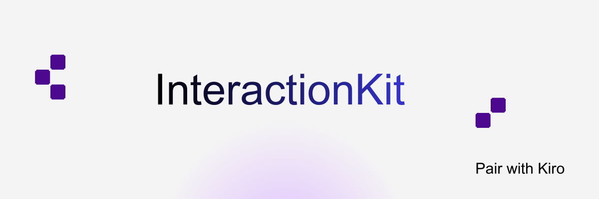
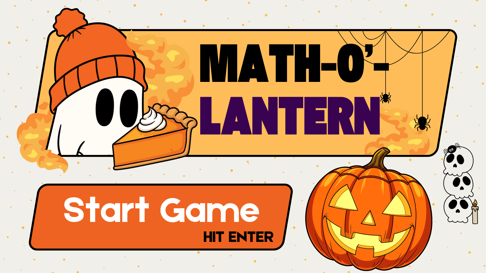

# Kiro InteractionKit

A clean, starter-friendly template for building gesture-controlled games, creative apps, and interactive experiences using Kiro.

Kiro InteractionKit gives developers a lightweight, flexible foundation for turning real-time **hand, face, and head tracking** into simple, intuitive controls. 

This code skeleton removes all the complexity of **MediaPipe + Computer Vision code** and gives you a clear Python **interaction layer** you can plug directly into games, creative apps & accessibility tools.

Want to build a **Mario-style game where jumping = open palm**? Make **music just by moving your head**? Or **draw in mid-air with your fingertip** for a fresh twist on Pictionary? Speed up development and build  creative apps with the Kiro InteractionKit.

---
## Featured Applications Built With Kiro InteractionKit

### 1. Math-O-Lantern (Interactive Game) 🎃

<table>
<tr>
<td align="center">




</td>
</tr>

<tr>
<td>

<strong>A fun, hand-controlled pumpkin-slicing game</strong> where players solve quick math problems by pinching to slice the correct pumpkins.<br><br>

**Play the PyGame →** [**Test the Featured Applications**](#2-test-the-featured-applications)<br><br>
Built using Kiro’s <strong>pinch detection</strong>, <strong>hand tracking</strong>, and 
<strong>stabilized gesture signals</strong>, making gameplay feel responsive without any custom CV code.
</td>
</tr>
</table>

---

### 2. Holo-Board (Glassboard for YouTube) ✏️

<table>
<tr>
<td width="40%">
  
</td>
<td width="60%">
  <strong>Try it Out:</strong>  
  <a href="#2-test-the-featured-applications">Test the Featured Applications</a>  
<br><br>
<strong>Holo-Board is a transparent, gesture-controlled whiteboard recorder</strong> that lets you draw in mid-air while your webcam captures you on screen.<br><br>
You control the whiteboard with simple gestures: <strong>Point</strong> to draw, <strong>Open Hand</strong> to stop, make a <strong>Fist</strong> to change color, and make a <strong>Rock Sign</strong> to clear the canvas. You can create floating annotations just like a studio glassboard.<br><br>
  The app includes a <strong>Record</strong> button that captures your video, audio, and air-drawn ink into a single downloadable clip. Recordings are saved in the Holo-Board folder.
</td>
</tr>
</table>


# Get Started with InteractionKit

## 1. Clone and Open in Kiro IDE

```bash
git clone https://github.com/Harpita-P/Kiro-InteractionKit.git
cd Kiro-InteractionKit

# macOS / Linux
./setup.sh

# Windows
.\setup.bat
```

The setup script tests your camera and prepares a virtual environment with Mediapipe, OpenCV, Pygame, and PyAutoGUI.
A webcam or built-in laptop camera is required. Don't forget to grant camera access to Kiro.

---
## 2. Test the Featured Applications
After completing the setup above, you can run the 2 app inside the `my_apps` folder.

### 🎃 Run Math-O-Lantern (Interactive Game)
```bash
python my_apps/Math-O-Lantern/main.py
```

### ✏️ Run Holo-Board (Glassboard Video Tool)
```bash
python my_apps/Holo-Board/main.py
```
To change the image being annotated, please replace 'heart-outline-annotate' in the assets folder with a new image with the file name 'annotate-imgname'.

---
## 3. Leverage Kiro's Superpowers
This starter kit is designed to work the Kiro IDE, which automates key parts of building gesture-controlled apps.

### **Hooks**  
Kiro uses the 3 Hooks in `.kiro/hooks/` to automatically integrate any new hand, head, or face gestures you request in your spec. If a gesture doesn't already exist, Kiro generates the detection logic and wires it into the correct controller—you don't have to write any MediaPipe or Motion Tracking code.

### **Steering Docs**  
The Steering Docs in `.kiro/steering/` guide Kiro on intended app architecture, proper gesture usage, and recommended testing approaches. These documents help ensure your InteractionKit project stays organized and scalable.

### **MCP**  
Through MCP in `.kiro/settings`, Kiro connects to **Context7**, giving it access to real-time MediaPipe and Pygame reference material. This allows it to generate accurate gesture-tracking logic and appropriate game components.  
To enable MCP, open **Kiro Settings → MCP** and add your Context7 API key. Get your key at https://context7.com/dashboard

### **Spec**  
Kiro uses a **spec-driven** workflow: you describe what your app should do and how gestures should behave, and Kiro converts that into a full design and task plan. This keeps your architecture clean and ensures gesture logic is integrated correctly.

---

## 4. Preview Hand, Face & Head Tracking Features

Before building a new app, preview the gesture tracking system. The InteractionKit template includes pre-built logic for hand, head, and face gestures using a clean controller-based API. You can preview all of the available gestures by running these tests:

```bash
python tests/CV-Test-Head.py
python tests/CV-Test-Hands.py
python tests/CV-Test-Face.py
```

A full list of pre-defined gestures can be found [here](#pre-defined-gestures). 

Now, let's build a new InteractionKit app with Kiro by creating a spec!

---

## 5. Start a New Project & Create a Spec
Delete the 2 existing applications in the `my_apps` folder and create a new folder for your app. Next, in the Kiro IDE, create a new spec from the **Specs** panel in the left sidebar using the **+** button, or by opening the command palette and searching for “New Spec.” When writing a spec, keep it focused and clear. Describe what the app does and how gestures should control the experience. 

### Example Spec for a Hand-Controlled Fruit Ninja Game  
```
This app is a basic fruit-slice game controlled by hand gestures. 
Fruits and bombs fall from the top of the screen. The player moves a cursor 
using an open hand and slices by performing a pinch gesture. Slicing a fruit 
awards 5 points. The player begins with 3 lives shown as hearts, and pinching 
a bomb causes it to explode and removes one life. When all lives are gone, 
the game ends. The game should include background music and sound effects, 
and all assets will be provided.
```
After creating your spec, Kiro will use the Hooks, Steering Docs, and MCP integration to design and build your app. All development occurs inside the `my_apps` folder, and any assets (images, audio, fonts) should be placed in your app’s `assets` directory. Kiro will automatically decide which gestures to implement—or generate new ones if needed.

---

## 6. Run Your App

```bash
python my_apps/my-game/main.py
```

That’s all it takes! 

---

### Pre-Defined Gestures

| Hand Gestures | Head Gestures | Face Gestures |
|---------------|---------------|----------------|
| Fist | Nod Up | Blink |
| Pinch | Nod Down | Smile |
| Peace | Turn Left | Mouth Open |
| Thumbs Up | Turn Right |  |
| Thumbs Down | Tilt Left |  |
| Rock Sign | Tilt Right |  |
| Open Hand |  |  |
| Pointing |  |  |
| OK Sign |  |  |
| Cursor Position |  |  |
